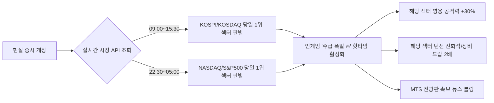

# 🗺️ 한·미 8대 섹터 테마 & 192종목 오픈월드 가이드 (Sector Guide)

> **문서 상태**: Active / Idle RPG Sector & Open World Sanctuary Guide  
> **지원 시장**: 🇰🇷 대한민국 KOSPI/KOSDAQ, 🇺🇸 미국 NASDAQ/S&P500  
> **총 섹터 수**: 시장별 8개 (총 16개 테마 섹터)  
> **총 종목 수**: 총 192개 대표 우량주 및 급등주 (한국 96개 + 미국 96개, 섹터당 12종목)  
> **오픈월드 규격**: 섹터 거리 8,000px, 섹터 반경 1,800px, 종목 성역 간격 995px  
> **최종 갱신일**: 2026-10-05  

---

## 1. 섹터 시스템 및 오픈월드 성역 개요 (Sector Overview)

`Stock RPG`의 오픈월드 맵은 중앙 증시 광장을 기점으로 8방위 네온 고속도로를 통해 8대 메가 섹터로 연결되어 있습니다.

- **192개 대형 종목 풀**: 각 섹터마다 현실 증시를 대표하는 12개 주요 종목(총 192종목)의 성역(Sanctuary) 제단이 995px 간격으로 쾌적하게 분산 배치되어 있습니다.
- **실시간 증시 수급 시각화**: 실제 현실 증시에서 당일 상승 종목은 붉은색 양봉 오라와 높은 점수로 개미의 우선 타겟이 되며, 하락 종목은 푸른색 음봉 캔들로 출현합니다.
- **변동성 완화장치(VI) 및 쿨타임 순회 규칙**:
  - 한 종목에서 연속 몬스터 처치 시(쿼터 28마리 도달) 🚨 **VI(20초 단일가 냉각)**가 발동합니다.
  - 플레이어는 VI 발동 즉시 이탈하며, **해당 종목은 10분(600초)간 타겟 선정에서 제외**됩니다.
  - 일반 파밍 완료 종목은 **5분(300초)**, 동일 섹터는 **90초** 쿨타임이 적용되어 전 섹터가 골고루 순회됩니다.

---

## 2. 🇰🇷 한국 시장 (KOSPI / KOSDAQ) 8대 메가 섹터 챕터

### 1) ⬆️ 반도체 밸리 (`semiconductor`)
- **챕터 테마**: AI 반도체 & HBM 대장 붉은 숲 (초고속 데이터 처리소)
- **주요 속성**: 🔴 BULL (공격형 성장주)
- **추천 포지션**: 치명타 및 단일 폭딜 딜러
- **소속 대표 영웅**:
  - **SK하이닉스 (SSR / 성장주)**: 궁극기 `HBM3E 풀가동` - 단일 적에게 550% 관통 폭딜
  - **한미반도체 (SSR / 성장주)**: 궁극기 `듀얼 TC본더 스트라이크` - 3연속 치명타 타격
  - **삼성전자 (SR / 가치주)**: 궁극기 `국민주의 품격` - 파티 전체 체력 30% 회복 및 실드 부여
  - **HPSP (SR / 성장주)**: 고압수소 어닐링 화염 레이저
  - **리노공업 (SR / 가치주)**: 테스트 소켓 관통 가시
- **섹터 시너지 [AI 반도체 동맹]**:
  - 2명: 치명타 확률 +15%
  - 3명 이상: 치명타 피해량 +40%, 적 방어력 20% 무시
- **던전 보상**: `양봉 캔들스틱 블레이드`, `HBM 가속기 칩셋` (공격/치명 세트)

---

### 2) ↗️ 전력망 & 원전 (`power_grid`)
- **챕터 테마**: AI 전력 쇼티지 & 차세대 원자력 르네상스 발전소
- **주요 속성**: 🔴 BULL / 🟡 DIVIDEND (버퍼 및 쿨다운 가속)
- **추천 포지션**: 스킬 쿨타임 감소, 궁극기 모멘텀 급속 충전
- **소속 대표 영웅**:
  - **HD현대일렉트릭 (SSR / 배당주)**: 궁극기 `초고압 변압기 과충전` - 10초간 전 파티원 스킬 쿨타임 30% 가속
  - **두산에너빌리티 (SSR / 성장주)**: 궁극기 `체코 원전 증기 터빈` - 광역 지속 화염 플라즈마
  - **LS ELECTRIC (SR / 가치주)**: 스마트 배전반 방어막
  - **효성중공업 (SR / 성장주)**: 변압기 낙뢰 투하
- **섹터 시너지 [무한 동력 전력망]**:
  - 2명: 전 파티원 스킬 쿨타임 15% 감소
  - 3명 이상: 전투 시작 시 궁극기 게이지 50% 즉시 충전
- **던전 보상**: `초고압 배전 코어`, `원자력 제어봉 펜던트` (쿨감/모멘텀 세트)

---

### 3) ➡️ 로봇 & AI 파크 (`robot_ai`)
- **챕터 테마**: 지능형 협동 로봇 및 피지컬 AI 연구 단지
- **주요 속성**: 🪄 테마주 (광역 마법 및 군중 제어 CC)
- **추천 포지션**: 적 전체 스턴, 넉백, 진형 붕괴
- **소속 대표 영웅**:
  - **두산로보틱스 (SSR / 테마주)**: 궁극기 `협동로봇 암 난무` - 전방 부채꼴 적 3초 스턴
  - **레인보우로보틱스 (SSR / 성장주)**: 궁극기 `휴머노이드 보행 돌격` - 전선 돌파 및 넉백
  - **NAVER (SR / 배당주)**: 하이퍼클로바 지능 버프 (아군 공격력 +25%)
  - **카카오 (SR / 테마주)**: 카나나 AI 에이전트 다중 분신
- **섹터 시너지 [지능형 자동화]**:
  - 2명: 적에게 가하는 모든 군중 제어(스턴/감속) 지속시간 +40%
  - 3명 이상: 적 처치 시마다 스킬 쿨타임 2초 즉시 초기화
- **던전 보상**: `협동 서보 모터`, `뉴로모픽 센서 아머` (공속/스턴 세트)

---

### 4) ↘️ K-조선 & 해운 (`shipbuilding`)
- **챕터 테마**: 친환경 LNG 도크 & 해상 슈퍼사이클 대양
- **주요 속성**: ⚪ VALUE / 🛡️ 가치주 (슈퍼 아머 및 지속 전선 유지)
- **추천 포지션**: 초고내구도 탱커, 밀려나지 않는 쇄빙선 방어
- **소속 대표 영웅**:
  - **HD한국조선해양 (SSR / 가치주)**: 궁극기 `불멸의 LNG 쇄빙선` - 6초간 완전 무적 및 전방 도발
  - **삼성중공업 (SR / 성장주)**: 궁극기 `FLNG 가스 폭격` - 해상 포격 지원
  - **한화오션 (SSR / 성장주)**: 궁극기 `미 해군 MRO 구축함` - 방어력 관통 어뢰
  - **HMM (SR / 가치주)**: 컨테이너 박스 방벽 설치
- **섹터 시너지 [해상 도크 철옹성]**:
  - 2명: 파티 최대 체력 +25%
  - 3명 이상: 체력 30% 이하 시 8초간 받는 피해 50% 반사
- **던전 보상**: `특수 고장력 강판 갑옷`, `LNG 쇄빙 앵커` (체력/방어 세트)

---

### 5) ⬇️ 2차전지 광산 (`battery`)
- **챕터 테마**: 전기차 캐즘 빙하기 & 혹독한 푸른 리튬 염호
- **주요 속성**: 🔵 BEAR (극도의 디버프 및 지속 동결 데미지)
- **추천 포지션**: 적 공격력 약화, 방어력 삭감, 하락장 도트딜
- **소속 대표 영웅**:
  - **에코프로비엠 (SSR / 테마주)**: 궁극기 `하이니켈 양극재 열폭주` - 적 방어력 40% 영구 감소
  - **LG에너지솔루션 (SSR / 가치주)**: 궁극기 `기가팩토리 셀 베리어` - 적 원거리 공격 반사
  - **POSCO홀딩스 (SR / 가치주)**: 리튬 염호 침식 늪 (적 이동/공격속도 50% 감속)
  - **포스코퓨처엠 (SR / 성장주)**: 음극재 흑연 파편 사격
- **섹터 시너지 [캐즘 극복 퀀텀점프]**:
  - 2명: 적의 공격력을 20% 영구 약화
  - 3명 이상: 적이 받는 도트(출혈/빙결/화상) 피해량 100% 증폭
- **던전 보상**: `전고체 배터리 코어 쉴드`, `하이니켈 스파이크` (디버프/반사 세트)

---

### 6) ↙️ 금융 & 밸류업 (`finance`)
- **챕터 테마**: 자사주 소각 & 고배당 황금 요새
- **주요 속성**: 🟡 DIVIDEND (골드 생산량 증가 및 폭발적 파티 힐링)
- **추천 포지션**: 파티 유지력 극대화, 방치 배당금 보너스
- **소속 대표 영웅**:
  - **KB금융 (SSR / 배당주)**: 궁극기 `1조 원 자사주 소각` - 전 파티원 체력 100% 완전 회복 및 디버프 해제
  - **신한지주 (SR / 배당주)**: 궁극기 `분기 균등 배당 힐` - 8초간 지속 재생
  - **메리츠금융지주 (SSR / 배당주)**: 궁극기 `주주환원율 50%의 위엄` - 파티 전체 공격력 +40%
  - **삼성화재 (SR / 가치주)**: 손해보험 무효화 실드
- **섹터 시너지 [황금 밸류업]**:
  - 2명: 스테이지 클리어 골드 및 방치 배당금 획득량 +30%
  - 3명 이상: 아군 사망 시 1회에 한해 50% 체력으로 즉시 부활
- **던전 보상**: `황금 배당 티켓 링`, `자사주 매입 금고` (골드 획득/부활 세트)

---

### 7) ⬅️ 바이오 & 헬스케어 (`bio`)
- **챕터 테마**: 임상 3상 바이오 연구소 & 불멸의 유전자 센터
- **주요 속성**: 🪄 테마주 / 💚 배당주 (상태이상 무효 및 폭발적 재생)
- **소속 대표 영웅**:
  - **삼성바이오로직스 (SSR / 가치주)**: 궁극기 `초격차 CDMO 배양기` - 파티 전체 슈퍼 아머 부여
  - **알테오젠 (SSR / 성장주)**: 궁극기 `피하주사 제형 변경` - 적 관통 독침 세례
  - **셀트리온 (SR / 배당주)**: 램시마 면역 항체 주입
- **섹터 시너지 [임상 승인 잭팟]**:
  - 2명: 모든 상태이상 면역
  - 3명 이상: 치명타 발생 시 20% 확률로 대미지 5배 터짐

---

### 8) ↖️ K-방산 & 우주항공 (`defense`)
- **챕터 테마**: 자주포 기동 시험장 & 누리호 발사 기지
- **주요 속성**: ⚔️ 성장주 (장거리 포격 및 광역 유도 미사일)
- **소속 대표 영웅**:
  - **한화에어로스페이스 (SSR / 성장주)**: 궁극기 `K9 자주포 일제사격` - 후열 적 즉사급 포격
  - **LIG넥스원 (SR / 성장주)**: 천궁-II 유도 미사일 탄막
  - **현대로템 (SR / 가치주)**: K2 흑표 전차 돌진
- **섹터 시너지 [자주국방 화력망]**:
  - 2명: 공격 사거리 +30%
  - 3명 이상: 후열 원거리 적 우선 타격 및 관통 피해

---

## 3. 🇺🇸 미국 시장 (NASDAQ / S&P500) 8대 메가 섹터 챕터

야간 시간대(미장 개장) 및 글로벌 던전 탭에서 선택 가능한 월스트리트 테마 던전입니다:

1. **실리콘밸리 AI 칩 (`us_ai_chips`)**:
   - 대표 영웅: **NVIDIA** (궁극기: `블랙웰 B200 텐서 코어 폭풍`), **AMD**
   - 시너지: 공격속도 +50%, 연쇄 번개 피해
2. **AI 전력망 & SMR (`us_power_smr`)**:
   - 대표 영웅: **Constellation Energy**, **Vistra**, **NuScale Power**
   - 시너지: 무한 마나 충전 및 스킬 재사용 대기시간 -35%
3. **빅테크 매그니피센트 7 (`us_bigtech_m7`)**:
   - 대표 영웅: **Microsoft**, **Apple**, **Google (Alphabet)**, **Meta**
   - 시너지: 4개 빅테크 동시 출격 시 적 전체 방어력 50% 삭감
4. **국방 AI & 안보 (`us_defense_ai`)**:
   - 대표 영웅: **Palantir** (궁극기: `AIP 고담 타겟팅 시스템`), **Lockheed Martin**
   - 시너지: 보스전 한정 공격력 80% 폭증
5. **전기차 & 로보택시 (`us_ev_robotaxi`)**:
   - 대표 영웅: **Tesla** (궁극기: `FSD 완전 자율주행 들이받기` & `옵티머스 군단`)
   - 시너지: 이동속도 +60%, 충돌 피해
6. **월가 메가뱅크 (`us_wallst_banks`)**:
   - 대표 영웅: **JPMorgan Chase**, **Berkshire Hathaway (워런 버핏)**
   - 시너지: 방치 보상 2배, 전투 패배 방지 금고
7. **글로벌 헬스케어 (`us_healthcare`)**:
   - 대표 영웅: **Eli Lilly** (비만치료제 마운자로 돌풍), **Novo Nordisk**
   - 시너지: 지속 흡혈 25%
8. **리테일 & 소비재 (`us_retail_consumer`)**:
   - 대표 영웅: **Costco**, **Walmart**, **Amazon**
   - 시너지: 장비 드랍률 +50%

---

## 4. 실시간 증시 연동 수급 버프 매커니즘 (Daily Surging Momentum)

- **지식 기반 플레이의 쾌감**:
  - 실제 아침 경제 뉴스를 본 유저는 "오늘 반도체가 급등하네? 오늘 던전은 반도체 밸리를 돌고, SK하이닉스 덱으로 보스를 밀어야겠다!"는 현실 증시와 게임이 일치하는 독보적인 몰입감을 경험하게 됩니다.

---

## 5. 섹터별 실시간 속보 & 긴급 이벤트 스폰 일람 (Breaking News Events)

인게임 전광판에 특정 종목의 속보가 발령되면, 해당 종목이 배치된 전장 또는 해당 섹터 던전 입구에 **3~5분 한정 긴급 이벤트**가 동적으로 생성됩니다:

| 섹터 | 대표 속보 헤드라인 | 이벤트 스폰 위치 | 이벤트 내용 및 보너스 |
| :--- | :--- | :--- | :--- |
| **반도체 밸리** | `[속보] SK하이닉스, 차세대 HBM 수주 잭팟!` | SK하이닉스 근처 / 반도체 던전 | **황금 HBM 포털**: 3분간 처치 시 하이닉스 지분 조각 2배 드랍 |
| **전력망 & 원전** | `[속보] 체코 원전 최종 본계약 체결 완료!` | 두산에너빌리티 근처 / 원전 던전 | **증기 터빈 과충전 존**: 스킬 쿨타임 50% 단축 버프 존 생성 |
| **금융 & 밸류업**| `[속보] KB금융, 대규모 자사주 소각 단행!` | KB금융 근처 / 금융 던전 | **황금 배당 금고**: 필드에 즉시 오픈 가능한 배당 상자 3개 투하 |
| **2차전지** | `[속보] 외국인, 2차전지 대량 공매도 리포트!` | 에코프로 근처 / 배터리 던전 | **공매도 베어 긴급 레이드**: 60초 내 격파 시 손실 100% 방어 및 유물 획득 |
| **빅테크 M7** | `[속보] NVIDIA, 블랙웰 AI 칩 공급 가속화!` | NVIDIA 근처 / 실리콘밸리 던전 | **텐서 코어 레이저 타워**: 전 화면에 2초마다 500% 번개 방전 지원 사격 |

